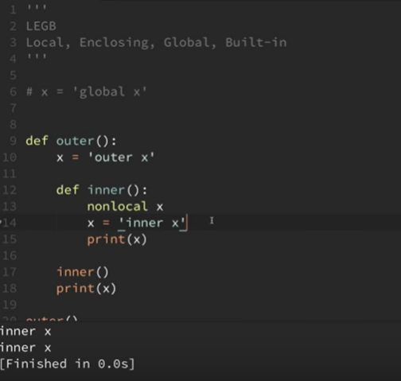

# Variable Scope(preetha)

- Scoping Rules
- LEGB
 > Local, Enclosing, Global, Built-in
## Sequence:
- Local: defined within a function
- Enclosing: in local scope of an enclosing function
- Global:at the top level using global keyword
- Built in: pre-assigned

- To access a global variable inside a function:
```
global variable_name
```
- To access the enclosing function variable
```
nonlocal var_name
```

**LEGB variable scopes :** (aditya)

* Whenever a variable is used,  its existence is checked in the following order : L(local), E(enclosing), G(global), B(built-in).
* The enclosing variables can be accessed for a nested function using the nonlocal keyword as follows:

 


**Note :** For slicing, the positive and the negative indices can be mixed up and used together.

