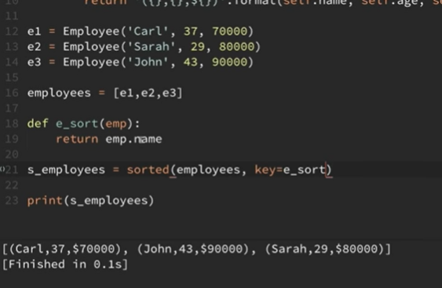

# Sorting(preetha)

- A new sorted list
```
list2 = sorted(list1)
```

-  Sorting the list
```
list1.sort()
```

- Sorting the list in descending order 
```
list2 = sorted(list1,reverse=True)
```
```
list1.sort(reverse=True)
```

- Using a key 
```
sorted_list = sorted(list_1, key=abs)
```

**Sorting Lists, Tuples, Objects :**  (aditya)

* sort(), sorted().
* Sorting on a custom criteria :

```python3
l=[1,2,3,-6,-4,-5]

s_li=sorted(l)		# [-6,-5,-4,1,2,3]

s_li=sorted(l,key=abs)		#[1,2,3,-4,-5,-6] , key takes a function name
```

* Sorting Objects :



