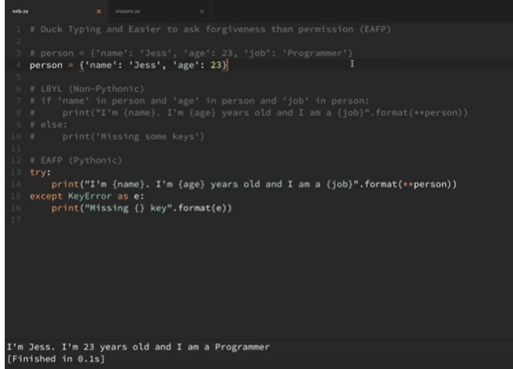

**EAFP(easier to ask forgiveness than permission) :**

* try to access something or write a code, if it doesn't work then just handle it.

  

* advantages : more readable, lesser code as a result of lesser checks.

**F-strings :**

```python3
vals=[26,3,23]
print(f"my fav numbers are {vals[0]} and {vals[1]}")

pi=3.1456783422
print(f"pi value rounded is {pi:.4f}")
```