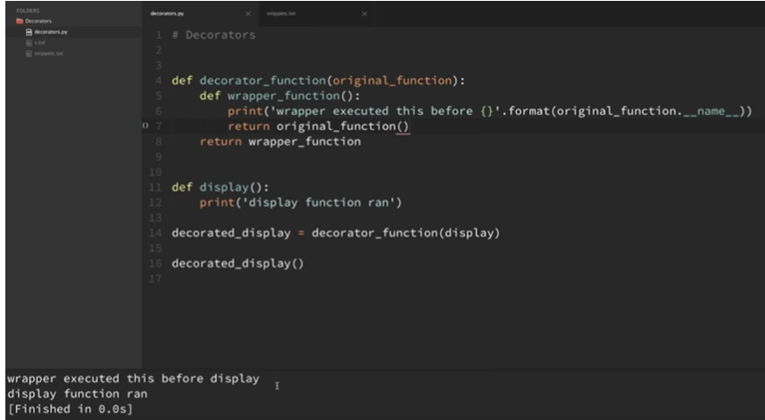
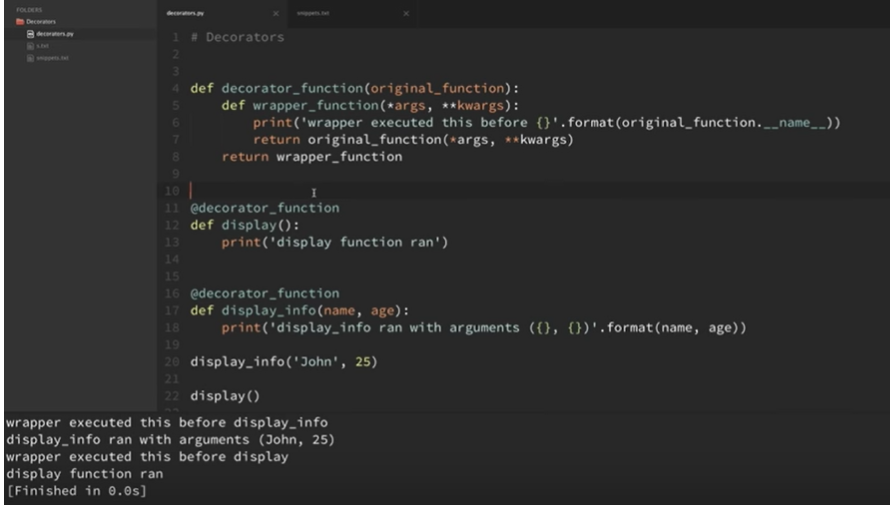

# Decorators(preetha)

- Functions are passed as arguements.
```
def my_decorator(func):
    def wrapper():
        print("Wrapper function is beginning to be executed")
        func()
        print("Function has been executed")
    return wrapper

@my_decorator
def print_hi():
    print("Hi!")
```

-  @my_decorator is just an easier way of saying print_hi = my_decorator(print_hi).

**Decorators :**(aditya)

* A decorator is a function that takes a function as argument, performs some tasks without altering the source code of the passed function and returns another function.
* Use : adding additional functionality to a function without modifying its code.

 

* Instead of writing the last two lines, the more commonly used syntax is as follows:

 

* When the arguments are present in the original function, the wrapper function and the original function must have the args and kwargs.

