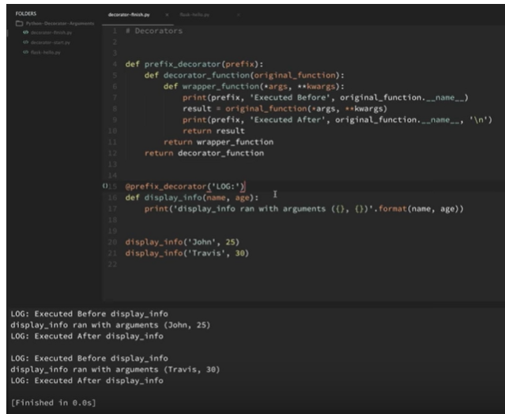

# Decorators with arguements(preetha)
- The wrapper_do_twice() inner function now accepts any number of arguments and passes them on to the function it decorates.

**Decorators with arguments :**(aditya)

* Whenever there's a need to pass arguments, to the decorator function, nest it into one more level and pass the arguments to that outer function, which could be used by the previous decorator function and the further nested ones.

  

(lalith)
 

(prvnrj)
DECORATOR WITH ARGUMENTS

def prefix_decorator(prefix):
    def decorator(original):
        def wrapp(*args,**kwargs):
            print(prefix,'Before {}'.format(original.__name__))
            result= original(*args,**kwargs)
            print(prefix,'After {}'.format(original.__name__))
            return result
        return wrapp
    return decorator

'''class decorator_class(object):
    def __init__(self,original):
        self.original=original
    def __call__(self,*args,**kwargs):
        print('Inside the call method {}'.format(self.original.__name__))
        return self.original(*args,**kwargs)'''

'''@decorator_class
def output():
    print("Function executed")'''
@prefix_decorator('TESTING:')
def output_info(empno,age):
    print('Function executed with arguments {} {}'.format(empno,age))

output_info(1081916,22)

