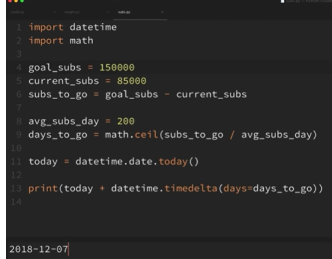

# Calculating number of days, weeks, or months to reach specific goals(preetha)


## Example 1:  A code to pay off a particular amount of balance with a set interest rate

```
import datetime
import calender

balance = 5000
interest_rate = 13 * 0.01
monthly payment = 500

today = datetime.date.today()
days_in_current_month = calender.monthrange(today.year , today.month)[1]
days_until_end_of_month = days_in_current_month - today.day

start_date = today + datetime.timedelta(days=day_till_end_motnh + 1)
end_date = start_date

while balance > 0:
	interest_charge = (interest_rate / 12)*balance
	balance += interest_charge
	balance -= monthly_payment
	
	balance = round(balance,2)
	if balance < 0:
		balance = 0
	
	print(end_date, balance)
	
	days_in_current_month = calender.monthrange(today.year , end_date.month)[1]

	end_sate = end_date + end.timedelta(days=days_in_current_month)
	
```

## Example 2: To reach a target weight
```
import datetime
current weight = 220
goal_weight = 180
avg_lbs_week = 1.5

start_date = datetime.date.today()
end_date = start_date

while current_weight > goal_weight:
	end_date+=datetime.timedelta(days=7)
	current_weight -=avg_lbs_week

print(f'Reached goal in {(end_date-start_date).days //7 }weeks')
```

**Calculating no. of days, weeks and months :**(aditya)

* import datetime, calendar
* calendar.monthrange(year,month) : returns a list of the starting day of the month and the no. of days in the month.
* Expected date to reach the subscriber goal:

  
(lalith)
1. Real world examples:- to calculate no of days or months that it will take to reach certain goals.

2. **Script to calculate the number of <u>months</u> that it would take to pay off the credit card:-**

   to find days in current month:-

    

   first value is first of the month that is monday in this case and second value is the total days in that month.

    

   days till next month:-

    

   to find the start date of next month:-

    

   code for this entire example:-

    

    

   o/p:-

    

   Balance becomes 0 in december.

3. **Script that will let you know if we wanted to get in better shape, how many <u>weeks</u> it will take us to lose a certain number of pounds:-**

   weights are in pounds

     

4. **Script to tell how many <u>days</u> will it take to reach a certain number of subscribers:- **

    

(prvnrj)
import datetime
import calendar

balance=5000
interest_rate= 13*.01
monthly_payment=500

today=datetime.date.today()
days_in_current_month=calendar.monthrange(today.year, today.month)[1]
days_till_end_month=days_in_current_month-today.day


start_date = today + datetime.timedelta(days=days_till_end_month + 1)
print(start_date)
end_date = start_date


while balance>0:
    interest_charge = (interest_rate/12)*balance
    balance+=interest_charge
    balance-=monthly_payment

    balance=round(balance,2)
    
    if balance<0:
        balance=0 
    
    print(end_date, balance)
    
    dys_in_current_month = calendar.monthrange(end_date.year, end_date.month)[1]
    print(days_in_current_month,end_date.month)
    end_date = end_date + datetime.timedelta(days=days_in_current_month)


Output:
2019-02-01
2019-02-01 4554.17
28 2
2019-03-01 4103.51
31 3
2019-04-01 3647.96
30 4
2019-05-01 3187.48
31 5
2019-06-01 2722.01
30 6
2019-07-01 2251.5
31 7
2019-08-01 1775.89
31 8
2019-09-01 1295.13
30 9
2019-10-01 809.16
31 10
2019-11-01 317.93
30 11
2019-12-01 0
31 12


import datetime

actual_weight=54
target = 65
avg_wt_lbs=1

today=datetime.date.today()

end_date=today

while actual_weight < target:
    end_date+=datetime.timedelta(days=7)
    actual_weight+=avg_wt_lbs

print(end_date)

print(f'Completed in {(end_date-today).days} days')


Output:

2019-04-07
Completed in 77 days
