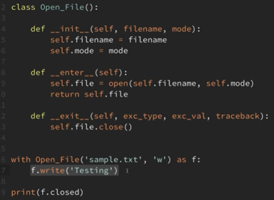
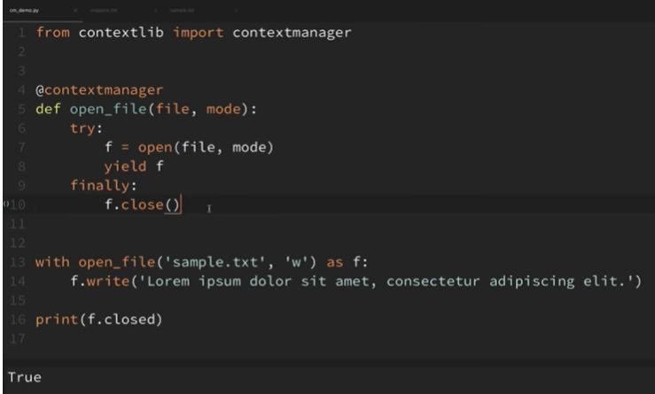

# Efficiently Managing Resources(preetha)

- 2 ways to open a file: with and without using a context manager.
- Context managers allow us to specify what exactly we want to set up and tear down when working with file objects.
- It handles the tear down the necessary resources.
- To open it using context manager use "with".
- No need to close the file after working with it.

## Using a class
``` 
class Open_file():
	def __init__(self, filename, mode):
		self.filename=filename
		self.mode=mode
		
	def __enter__(self):
		self.file=open(self.filename.self.mode)
		return self.file
		
	def __exit__(self,exc_type,exc_val,traceback):
		self.file.close()
		
with Open_file('sample.txt','w') as f:
	write('Testing')

```

## Using a function

- context manager has to be imported from contextlib
```
from contextlib import contextmanager

@contextmanager
def open_file(file,mode):
	f=open(file,mode)
	yield f
	f.close()

with Open_file('sample.txt','w') as f:
	write('The whole message.')
```

## Without a context manager
``` 
import os
from contextlib import contextmanager

cwd = os.getcwd()
os.chdir('Sample-Dir-One')
print(os.listdir())
os.chdir(cwd)


cwd = os.getcwd()
os.chdir('Sample-Dir-Two')
print(os.listdir())
os.chdir(cwd)
```
## creating a context manager
```
@contextmanager
def change_dir(destination):
	try:
		cwd = os.getcwd()
		os.chdir(destination)
		yield
	finally:
		os.chdir(cwd)
```
**Context Manager :**(aditya)

* for the efficient management of resources.
* say for a file, even if we dont explicitly close it, it handles the operation.
* context manager with a class :



* context manager with function :

 
