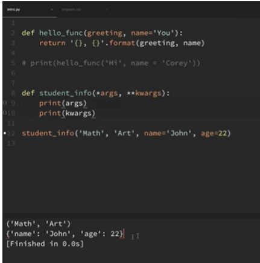
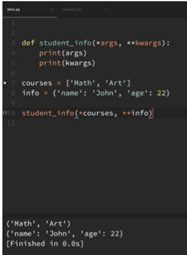

**Functions :**

* piece of reusable code
* Declaration :

```python3
def func():						# function with no args			
	print('Hello world')
	
def func(name):					# function with args
	print('Hello, {}'.format(name))
	
def func(name,age=21)			# function with default args
	print('Hello, {}, of {} years old'.format(name,age))
```

* args, kwargs :



* args : positional arguments ; kwargs : keyword arguments. There can be arbitrary number of arguments.

   